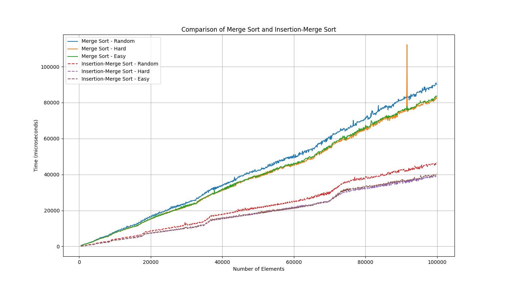

# Задача А2

**Колобанов Никита Дмитриевич. 248. Set 3.**

-   Класс создания массивов трех типов Random, Hard(реверснутый), Easy(практически отсортированный) я реализовал в файлах «ArrayGenerator.cpp» и «ArrayGenerator.h».
-   Класс SortTester для тестирования функций я реализовал в файлах «SortTester.cpp» и «SortTester.h».
-   Все основные алгоритмы и вспомогательные функции я реализовал в файлах «insertionMerge.cpp» и «instertionMerge.h».
-   Тестировал я алгоритмы в файле «main.cpp» при выключенными остальными программами и использовал лямбда функции для установки барьера алгоритма insertionSort, который я выбрал 16.
-   Результаты тестирования всех трех типов массивов я записал в «mergeResults.csv», «instertionMergeResults.csv» файлы.
-   После я создал файл «plot\_results.py» для построения графика сравнения скорости алгоритмов, еденицей измерения для которых я выбрал микросекунду.
-   График:

-   По графику видно что Merge+Insertion Sort чуть менее чем в два раза быстрее Merge Sort, из-за более быстрой работы алгоритма Insertion Sort на массивах меньшего размера.
-   Также можно заметить что реверснутые массивы не считаются сложными для алгоритма Merge, а более сложны для него массивы с рандомной сортировкой.
-   Задачу А2i я реализовал объеденив все необходимое в файле «А2i.срр» и сдал посылкой 349352055 на полное решение.
-   Все исходные файлы и решения я приложил в репозиторий GitHub [https://github.com/nikkol615/hse-se2-algo-set3-A2](https://github.com/nikkol615/hse-se2-algo-set3-A2)